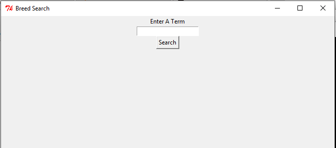
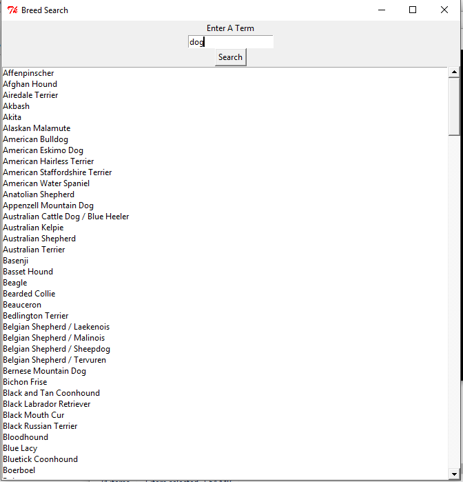

# Animal-Search
A GUI based Python Script That Searches For Breeds Of Animals  
  
Original Script "Animal Search.py"  
  
Used api.petfinder.com  

Searchable Terms cat,dog etc...  

Compiled Exe Using PyInstaller (http://www.pyinstaller.org/)  

Exe Located At dist/Animal Search/Animal Search.exe  
  
packages used:  
Tkinter -> GUI  
requests -> Sending get request  
json -> parsing json  
tkMessageBox -> Display Alert Dialogs  
  
TODO:  
1) Add Internet Check  
2) Add Multiple Apis  
3) Improve UI  

Screenshots  
**Welcome Screen**  
  
 
  

  

